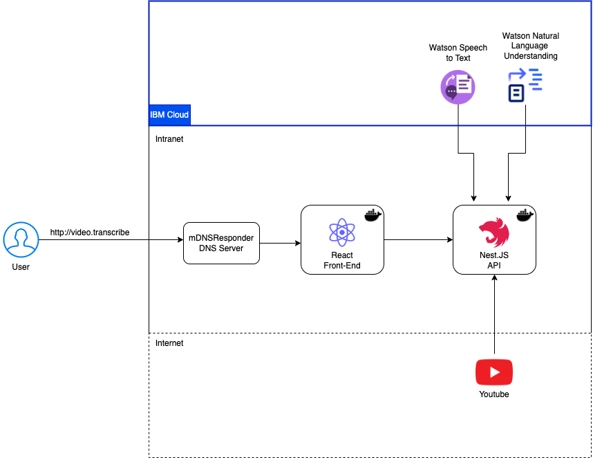

# Video Transcription Application

`Author: Jan Peter Merkel `


# Application Demo


https://user-images.githubusercontent.com/22799983/231574932-500bd5f8-4ea3-4022-a5b5-73ad9ae2c51f.mp4


# Content:
- [Video Transcription Application](#video-transcription-application)
- [Application Demo](#application-demo)
- [Content:](#content)
    - [Minimum requirements:](#minimum-requirements)
- [Scope:](#scope)
- [Application Architecture](#application-architecture)
  - [Architecture explanation](#architecture-explanation)
- [Folder Structure](#folder-structure)
- [Available Routes](#available-routes)
  - [`[POST]` - Routes](#post---routes)
    - [`/video`](#video)
    - [`/analyze`](#analyze)
- [4. Development Environment Setup](#4-development-environment-setup)
  - [Rest API configuration](#rest-api-configuration)
    - [Install Node.js and npm:](#install-nodejs-and-npm)
    - [Install Nest.js CLI:](#install-nestjs-cli)
    - [Install dependencies:](#install-dependencies)
    - [Run application on development mode:](#run-application-on-development-mode)
  - [Front End configuration](#front-end-configuration)
    - [Install dependencies:](#install-dependencies-1)
    - [Run application on development mode](#run-application-on-development-mode-1)
  - [Build Docker Containers Locally](#build-docker-containers-locally)
- [References](#references)


### Minimum requirements:
To run this application you should have the following dependencies on your machine:
 - [Node](https://nodejs.org/en/download)
 - [Docker](https://www.docker.com/products/docker-desktop/)

 **Note:** Ensure npm is also installed and available on your PATH.


# Scope:
The scope of this project is to create an application capable of transcribing videos from youtube and get the categories cited on the video.

> **Note: 
> - The audio transcription API only processes videos that are 5 minutes or less
> - At the moment this application supports only videos in Portuguese**


# Application Architecture




## Architecture explanation

`mDNSResponder` is the local DNS server responsible for translating the application url to an IP.

Afterwards the `Front End React application` will send Youtube URL'S to the rest API.

The `Rest API` will download the audio from the youtube video, then it will send to the `Watson Speech to Text API` and this API will extract the transcript from the audio file.

The transcript will be sent to `Watson Natural Language Understanding` to get the main categories cited on the video.

The video transcription and the categories identified by Watson Natural Language Understanding will be sent to the  `Front End React application`.

# Folder Structure

```
├── README.md
├── documents
└── source
    │ 
    │ 
    ├── front_end - Front End Application folder
    │   ├── Dockerfile - instructions for building a Image
    │   ├── index.html - Index HTML File
    │   ├── nginx.conf - Nginx server configuration
    │   ├── package-lock.json - dependencies file
    │   ├── package.json - dependencies file
    │   ├── public - Public folder
    │   ├── src - React Application code
    │   │   ├── App.css - Homepage file Style
    │   │   ├── App.tsx - Homepage
    │   │   ├── assets - Assets folder
    │   │   │   ├── components - React components
    │   │   │   ├── images - Images used on the project
    │   │   │   └── styles - Css files
    │   │   ├── config.tsx - Rest API configuration file
    │   │   ├── index.css - Index style
    │   │   ├── main.tsx - Main file, Application routes
    │   │   ├── pages - React application pages
    │   ├── tsconfig.json
    │   ├── tsconfig.node.json
    │   └── vite.config.ts
    │
    │
    └── rest_api
        ├── README.md
        ├── dockerfile - Instructions for building a Image
        ├── downloads  - Temporary download folder
        ├── nest-cli.json
        ├── package-lock.json - dependencies file
        ├── package.json - dependencies file
        ├── src
        │   ├── app.controller.spec.ts
        │   ├── app.module.ts
        │   ├── controllers - Application Controllers
        │   ├── dto - Data Transfer Object
        │   ├── interfaces - Interfaces
        │   ├── main.ts - Main file, server start
        │   └── services
        ├── test
        ├── tsconfig.build.json
        └── tsconfig.json
```


# Available Routes

## `[POST]` - Routes
---

### `/video`
Transcribes the video and returns the text transcript and the main categories.

expected request body:

```
{
	"url":"https://www.youtube.com/shorts/TLYVC8fTDl0"
}
```

expected response body:

```
{
	"transcription": "Text",
	"categories": ["category 1","category 2","category 3"]
}
```

### `/analyze`
Extracts the categories of the text sent

expected request body:
```
{
	"transcription":"Text"
}
```

expected response body:

```
["news and politics","weather","science","environment","geology"]
```

# 4. Development Environment Setup

## Rest API configuration

To configure the Rest API, you will need to go to the `./source/rest_api/` folder.

### Install Node.js and npm: 
Nest.js is built on top of Node.js, so you'll need to install Node.js and npm (Node Package Manager) to get started. You can download and install Node.js from the [official Node.js website](https://nodejs.org/).

### Install Nest.js CLI:

Nest.js provides a CLI (Command Line Interface) tool that makes it easy to create, manage and run Nest.js applications. To install the Nest.js CLI, open your terminal or command prompt and run the following command:

`npm install -g @nestjs/cli`

### Install dependencies: 
Go to the root directory of the rest_api project (cd `./source/rest_api`) and install the project dependencies by running the following command:

`npm install`

This will install all the dependencies listed in the `package.json` file.


Before running the application, copy the `.example.env` file, rename it to `.env` and change the following values

```
STT_API_KEY=< your IBM Watson Speech to Text API Key>
STT_URL=< your IBM Watson Speech to Text URL>
NLU_API_KEY=< your IBM Watson Natural Language Understanding API Key>
NLU_URL=< your IBM Watson Natural Language Understanding URL>
```

### Run application on development mode:

Once the dependencies are installed and the env file is filled, you can start the application in development mode by running the following command:

`npm run start:dev`

This will start the Nest.js application in watch mode, which means any changes you make to the code will automatically restart the server.

You should now be able to access the application at http://localhost:8080.


## Front End configuration

### Install dependencies: 
On the root directory of the front-end application (cd `./source/front_end`) and install the project dependencies by running the following command:

`npm install`

### Run application on development mode

If you want, you can change the Rest API URL on the `./source/front_end/src/config.tsx` file. 
Once the dependencies are installed, you can start the application by running the following command:

`npm run dev`

This will start the development server and open your application in a new tab in your default browser.

## Build Docker Containers Locally

Go to the `./source` folder, and then you can run both applications with

`docker compose up -d`

The front-end will be available on
`http://localhost/`

and the back-end will be available on
`http://localhost:8080`

# References
- [Docker Compose](https://docs.docker.com/compose/)
- [Dockerfiles](https://docs.docker.com/engine/reference/builder/)
- [IBM Watson Natural Language Understanding](https://cloud.ibm.com/docs/natural-language-understanding?topic=natural-language-understanding-getting-started)
- [IBM Watson Speech to Text](https://cloud.ibm.com/docs/speech-to-text?topic=speech-to-text-gettingStarted)


